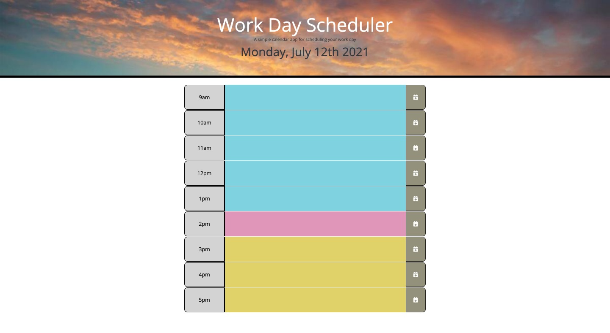

# homework05-workdayscheduler

This is the link to the following assignment: [link](https://valbona1992.github.io/homework05-workdayscheduler/)

## Summary
This assignment required me to modify code given a starter code for a work day scheduler web app. 

Below is a summary of what I implemented. 

* Added HTML to include basic information for each work day hour of the day. 
* Added classes to the HTML code to reference the given CSS file.  
* Added code to implement Moment.js for the current date to be displayed on the browser. 
* Added code to loop through the timeblocks to determine past, present, or future hours. 
* Added a function to save the added text into local storage

## Screenshot
 

